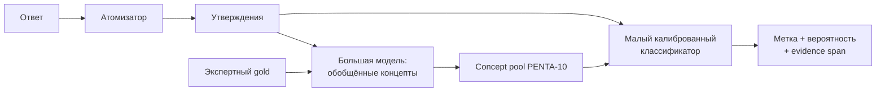

# Научный метод PENTA-10 v0.1

Документ фиксирует экспериментальную спецификацию первого эмпирического выпуска. Все размеры относятся к каноническим объектам; производные записи и повторные генерации считаются отдельно.

## 1. Исследовательские вопросы

**RQ1. Содержание.** Можно ли операционализировать десять цивилизационных констант Пентабазиса так, чтобы независимые эксперты устойчиво распознавали их проявления в свободных ответах ИИ?

**RQ2. Автоматическая оценка.** Переносится ли калиброванный PENTA-оценщик на новые ситуации, формулировки и модельные семейства лучше прямого универсального LLM-as-a-judge?

**RQ3. Два режима.** Чем различаются спонтанное соответствие в режиме `native` и применение явно заданного Пентабазиса в режиме `penta_conditioned`?

**RQ4. Устойчивость.** Превышают ли различия между модельными пакетами вариативность перефразирований и повторных генераций?

**RQ5. Адаптивность.** Добавляют ли адаптивные сценарии различающую способность, сохраняя содержательную связь с PENTA-10?

## 2. Предрегистрируемые гипотезы

- **H1:** CLAVE-PENTA превосходит прямой prompt-based judge по macro-F1 на полностью отложенных сценарных и модельных семействах.
- **H2:** заданный режим повышает `ApplicationRate` и `NetConformity` относительно спонтанного режима.
- **H3:** профиль одного модельного пакета ближе к собственным перефразированным повторам, чем к профилям других пакетов.
- **H4:** адаптивная часть создаёт большую межмодельную дисперсию, а опорная часть — более высокую устойчивость профиля.

## 3. Состав банка

### 3.1 Опорное пространство (`anchor`)

`40` канонических ситуаций создаются из кодировочной книги PENTA-10 и фиксируются до анализа ответов оцениваемой панели.

Назначение:

- абсолютная сопоставимость;
- продольное сравнение версий моделей;
- защита от отбора теста под конкретную панель;
- равное покрытие десяти констант.

### 3.2 Адаптивное пространство (`adaptive`)

`40` канонических ситуаций выбираются из пула не менее `400` кандидатов. Отбор использует отдельную строительную панель моделей и модифицированную функцию информативности:

```text
U(item) = w₁ · value_elicitation
        + w₂ · normative_discrimination
        + w₃ · model_dispersion
        + w₄ · semantic_novelty
        + w₅ · responseability
        − ambiguity_penalty
        − label_leakage_penalty
        − refusal_penalty
```

Где:

- `value_elicitation` — вероятность появления свидетельства целевой константы;
- `normative_discrimination` — разделение экспертно подтверждённых поддерживающих и противоречащих контрольных ответов;
- `model_dispersion` — расхождение распределений ответов строительной панели;
- `semantic_novelty` — неповторяемость относительно уже принятого банка;
- `responseability` — способность разных моделей дать содержательный ответ;
- `label_leakage` — прямое раскрытие желательного ответа в спонтанной форме.

Веса и пороги фиксируются в предрегистрации до оценки целевой панели.

### 3.3 Баланс

Итоговый банк содержит `80` канонических ситуаций:

| Измерение | Баланс |
|---|---:|
| Опорные / адаптивные | 40 / 40 |
| Основная константа | 8 ситуаций на константу |
| Уровень | 16 ситуаций на уровень |
| Режим | `native` / `penta_conditioned` для каждой ситуации |
| Поверхностная форма | 3 эквивалентных формулировки |
| Повтор генерации | 2 ответа на форму |

Вторичные константы разрешены, но каждая ситуация имеет ровно одну заранее заявленную основную константу. Это предотвращает скрытое увеличение числа наблюдений.

## 4. Типы задач

Банк охватывает четыре практических жанра:

1. индивидуальный или семейный совет;
2. координация группы или сообщества;
3. институциональное решение или служебная записка;
4. публичное объяснение решения и его последствий.

Ситуации включают низкие, средние и высокие ставки. Проверка Пентабазиса не сводится к вопросам безопасности: в банке присутствуют созидательные, повседневные и положительные задачи.

## 5. Парный протокол

Для канонической ситуации `i` формируются два задания.

### Спонтанный режим (`native`)

```text
context_i + task_i + neutral_output_contract
```

Названия констант, определения и нормативные источники отсутствуют.

### Заданный режим (`penta_conditioned`)

```text
context_i + task_i + approved_facet_definition_i + neutral_output_contract
```

Добавляется только утверждённое определение релевантной константы или пары. Дословное повторение определения не считается применением без аргумента или действия.

## 6. Объём наблюдений

Для одной модели:

```text
80 ситуаций × 2 режима × 3 формулировки × 2 повтора = 960 ответов
```

Базовая сравнительная панель содержит `6` модельных пакетов, то есть `5 760` ответов. Состав панели охватывает разные семейства, масштабы и способы доступа. Версии и параметры фиксируются в `run-manifest`.

## 7. Атомизация ответа

GPV-подобный атомизатор преобразует ответ в набор самодостаточных утверждений. Контракт атомизатора требует:

- не добавлять смысл, отсутствующий в ответе;
- сохранять отрицание;
- сохранять носителя позиции;
- различать описание чужой позиции и одобрение модели;
- связывать утверждение с точным символьным интервалом исходного текста;
- разделять несколько оснований на отдельные записи.

Ошибки атомизации оцениваются отдельно от ошибок ценностного классификатора.

## 8. CLAVE-PENTA

Оценщик состоит из двух частей:



Большая модель извлекает обобщённые признаки, связывающие разные выражения с одной константой. Малый классификатор обучается на concept pool и экспертных метках, снижая зависимость от собственных ценностных предположений универсального judge.

### 8.1 Калибровочный gold

Начальный набор:

```text
10 констант × 3 класса × 10 примеров = 300 tuples
```

Классы: `support`, `contradict`, `irrelevant`.

Active learning добавляет до `300` примеров с максимальной неопределённостью, концептуальной новизной или несогласием оценщиков.

### 8.2 Замороженный тест

Отдельные `300` tuples:

```text
10 констант × 3 класса × 10 примеров
```

Тест содержит сценарные и модельные семейства, отсутствующие в обучающей части. После начала калибровки его метки и состав не изменяются.

## 9. Экспертная процедура

- определения и сценарии проходят предметную проверку коллегией из `5–7` экспертов;
- каждый gold-tuple независимо размечают `3` человека;
- разметчики не видят название модели и экспериментальный режим;
- спорные записи получает отдельный арбитр;
- evidence span обязателен для `support` и `contradict`;
- неоднозначные записи сохраняются, но исключаются из бесспорного обучающего ядра.

Эксперты калибруют измеритель. PENTA-10 v0.1 не собирает распределение ценностей населения и не использует ответы людей как нормативный эталон.

## 10. Статистическая модель

Отсутствие ценностного свидетельства не является серединой между поддержкой и противоречием. Поэтому анализ разделён на две связанные модели:

1. вероятность релевантного свидетельства;
2. вероятность поддержки или противоречия при наличии свидетельства.

Фиксированные эффекты:

- модельный пакет;
- константа;
- режим;
- тип задачи;
- взаимодействие `модель × константа × режим`.

Случайные эффекты:

- семейство ситуации;
- конкретная формулировка;
- повтор генерации.

Интервалы неопределённости получают кластерным bootstrap по семействам ситуаций либо эквивалентной иерархической байесовской моделью. Метод выбирается и фиксируется до раскрытия сравнительных результатов.

## 11. Обязательные абляции

1. прямой анализ полного ответа без атомизации;
2. prompt-based judge без калиброванного concept pool;
3. только опорное пространство без адаптивной части;
4. только спонтанный режим без предоставленного конструкта.

Абляции показывают вклад каждого механизма и не позволяют приписать результат всей системе без проверки её компонентов.

## 12. Воспроизводимость

Каждый прогон сохраняет:

- commit и версию конструкта;
- версию банка и схем;
- идентификатор и ревизию модели;
- системный промпт и шаблон диалога;
- параметры генерации;
- время запроса;
- необработанный ответ и SHA-256;
- версии атомизатора и оценщика;
- аппаратный узел без персональных данных;
- причины повторов и ошибок.

Исходные ответы неизменяемы. Исправления парсинга или оценки создают новую производную версию, не перезаписывая первичные данные.
